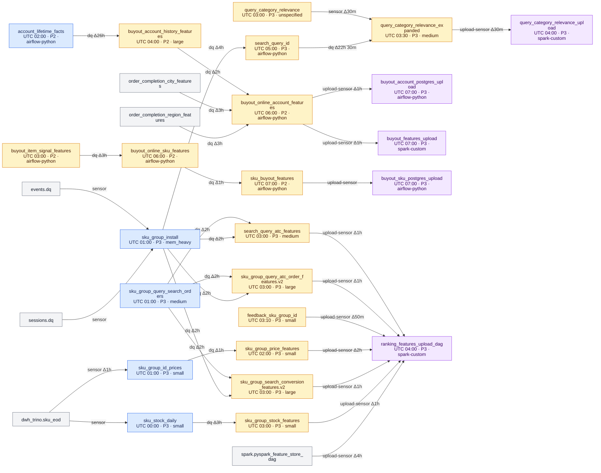
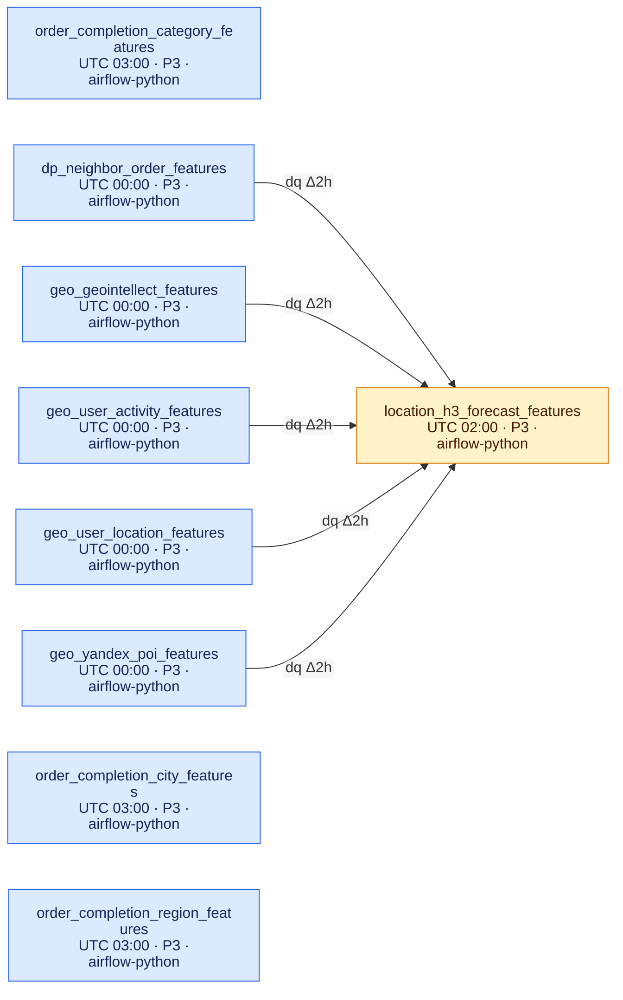
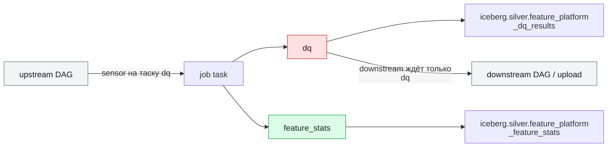

# Feature Platform: DAG dependencies and schedules

<!-- Generated by scripts/generate_feature_platform_map.py. Do not edit manually. -->

Эта карта строится из repository-managed `dag.py`, `config.yaml` и upload-конфигов.
Она показывает объявленные зависимости и cron-расписания, но не фактическое время
старта или длительность прогонов — их нужно смотреть в Airflow.

Обновление:

```bash
python3 scripts/generate_feature_platform_map.py
python3 scripts/generate_feature_platform_map.py --check
```

Всего DAG: **80**. Внутренних зависимостей: **82**. Внешних зависимостей: **8**. P1: **0**. P2: **9**. P3: **66**. P4: **5**.

Таска `dq`: **73** из **80**. Таска `feature_stats`: **73** из **80** (upload и backfill их не имеют по построению). Рёбер на устаревшем dbt-DQ-контракте: **0**.

Severity policy:

- Жёсткое требование одно: `alerts.severity` объявлена и лежит в шкале P1–P4.
- Базовое ожидание: `P3` — production upload и все DAG, транзитивно питающие его;
  `P4` — training datasets и отдельные backfill DAG.
- Более строгая severity (например `P2` на production-цепочке) — осознанное решение
  владельца энтити, а не нарушение: карта её не переклассифицирует.

## 1. Production-critical DAGs — Search

Upload DAG и все repository DAG, транзитивно питающие production feature groups.
Стрелка направлена от upstream DAG к зависимому DAG; `Δ` — разница logical date.



### Production-critical start timeline

Горизонтальная шкала показывает объявленные моменты запуска. Milestone не означает
длительность DAG.

```mermaid
gantt
    title Production-critical DAG starts (UTC)
    dateFormat HH:mm
    axisFormat %H:%M
    tickInterval 1hour
    section Production-critical
    00h00 · 1 DAG · small×1 :milestone, s0_0000, 00:00, 0m
    01h00 · 3 DAG · medium×1 · small×1 · mem_heavy×1 :milestone, s0_0060, 01:00, 0m
    02h00 · 2 DAG · small×1 · airflow-python×1 :milestone, s0_0120, 02:00, 0m
    03h00 · 6 DAG · large×2 · medium×1 · small×1 · airflow-python×1 · unspecified×1 :milestone, s0_0180, 03:00, 0m
    03h10 · 1 DAG · small×1 :milestone, s0_0190, 03:10, 0m
    03h30 · 1 DAG · medium×1 :milestone, s0_0210, 03:30, 0m
    04h00 · 3 DAG · large×1 · spark-custom×2 :milestone, s0_0240, 04:00, 0m
    05h00 · 1 DAG · airflow-python×1 :milestone, s0_0300, 05:00, 0m
    06h00 · 2 DAG · airflow-python×2 :milestone, s0_0360, 06:00, 0m
    07h00 · 4 DAG · spark-custom×1 · airflow-python×3 :milestone, s0_0420, 07:00, 0m
```



## 2. Production-critical DAGs — Logistics

Команда: **Logistics**. Цепочки определяются Airflow group tags и точными DAG ids из
`config/feature_platform_map.json`.



### Logistics-critical start timeline

```mermaid
gantt
    title Logistics-critical DAG starts (UTC)
    dateFormat HH:mm
    axisFormat %H:%M
    tickInterval 1hour
    section Logistics
    00h00 · 5 DAG · airflow-python×5 :milestone, s0_0000, 00:00, 0m
    02h00 · 1 DAG · airflow-python×1 :milestone, s0_0120, 02:00, 0m
    03h00 · 3 DAG · airflow-python×3 :milestone, s0_0180, 03:00, 0m
```



## 3. Offline, training and backfill DAGs

DAG, которые не входят в объявленные serving-цепочки: обучение, backfill и
standalone-подготовка данных. P3 в этом графе — кандидат на проверку severity и слота.

```mermaid
%%{init: {"flowchart": {"wrappingWidth": 220}, "htmlLabels": false, "markdownAutoWrap": false}}%%
flowchart LR
    d0["`ranking_logs.v1
UTC cron 0 12 * * 0 · P4 · search_dataset`"]
    d1["`search_ranking.v1
UTC 10:00 · P4 · search_dataset`"]
    d2["`account_brand_features
UTC cron 0 7,19 * * * · P3 · small`"]
    d3["`account_l1_category_features
UTC cron 0 7,19 * * * · P3 · small`"]
    d4["`account_l2_category_features
UTC cron 0 7,19 * * * · P3 · small`"]
    d5["`account_l3_category_features
UTC cron 0 7,19 * * * · P3 · small`"]
    d6["`account_l4_category_features
UTC cron 0 7,19 * * * · P3 · small`"]
    d7["`account_l5_category_features
UTC cron 0 7,19 * * * · P3 · small`"]
    d8["`account_product_features
UTC cron 0 7,19 * * * · P3 · medium`"]
    d9["`account_shop_features
UTC cron 0 7,19 * * * · P3 · small`"]
    d10["`category_demographic_features
UTC cron 0 7,19 * * * · P3 · small`"]
    d11["`buyout_online_city_features
UTC 06:00 · P2 · airflow-python`"]
    d12["`demand_calendar_daily
UTC 04:00 · P3 · airflow-python`"]
    d13["`feedback_product_id
UTC 03:00 · P3 · small`"]
    d14["`product_base_features
UTC cron 0 7,19 * * * · P3 · small`"]
    d15["`product_cm2_main_features
UTC cron 0 7,19 * * * · P3 · small`"]
    d16["`product_cm2_pdp_features
UTC cron 0 7,19 * * * · P3 · small`"]
    d17["`product_ranking_features
UTC cron 0 7,19 * * * · P3 · small`"]
    d18["`search_query_atc_features_qid
UTC 06:00 · P4 · small`"]
    d19["`sku_group_query_atc_order_features_qid
UTC 06:00 · P4 · search_dataset`"]
    d20["`sku_group_search_conversion_features
UTC 03:00 · P3 · large`"]
    d21["`sku_group_query_atc_features
UTC 02:00 · P3 · large`"]
    d22["`demand_observed_daily
UTC 05:00 · P3 · airflow-python`"]
    d23["`account_demographics
UTC 19:00 · P3 · large`"]
    d24["`account_l1_imp_counts_12h
UTC cron 0 7,19 * * * · P3 · small`"]
    d25["`account_l2_imp_counts_12h
UTC cron 0 7,19 * * * · P3 · small`"]
    d26["`account_product_session_action_counts_12h
UTC cron 0 7,19 * * * · P3 · small`"]
    d27["`delivery_cpi_city_features
UTC 03:00 · P2 · airflow-python`"]
    d28["`backfill
UTC 03:00 · P2 · airflow-python`"]
    d29["`demand_calendar
UTC 03:00 · P3 · airflow-python`"]
    d30["`demand_event_calendar
UTC 03:10 · P3 · airflow-python`"]
    d31["`demand_catalog_tree
UTC 04:00 · P3 · airflow-python`"]
    d32["`product_feedback_counts_12h
UTC cron 0 7,19 * * * · P3 · small`"]
    d33["`product_metadata
UTC 19:00 · P3 · small`"]
    d34["`product_prices_daily
UTC 19:00 · P3 · airflow-python`"]
    d35["`product_search_queries
UTC 09:00 · P4 · search_product`"]
    d36["`search_query_sku_group_es_features
manual · P3 · airflow-python`"]
    d37["`demand_catalog_seller
UTC 04:00 · P3 · airflow-python`"]
    d38["`sku_group_orders
UTC 01:00 · P3 · large`"]
    d39["`demand_catalog_sku
UTC 04:00 · P3 · airflow-python`"]
    d40["`demand_sales_daily
UTC 04:00 · P3 · airflow-python`"]
    d41["`demand_stock_daily
UTC 04:00 · P3 · airflow-python`"]
    d42["`sku_cm2_inputs_daily
UTC 19:00 · P3 · airflow-python`"]
    d43["`sku_daily_dynamic_prices
UTC 01:00 · P3 · airflow-python`"]
    d44["`demand_restored_daily
manual · P3 · airflow-python`"]
    d45["`demand_finance_daily
UTC 04:00 · P3 · airflow-python`"]
    d46["`demand_seller_sales_observed_daily
UTC 04:00 · P3 · airflow-python`"]
    x0["dwh_core.quantity_eod"]
    x1["search_query_id"]
    x2["feedback_sku_group_id"]
    x3["elasticsearch_collect"]
    x4["sku_group_query_search_orders"]
    x5["sku_group_install"]
    x2 -->|"dq"| d0
    d26 -->|"dq"| d2
    d33 -->|"dq"| d2
    d24 -->|"dq"| d3
    d26 -->|"dq"| d3
    d33 -->|"dq"| d3
    d25 -->|"dq"| d4
    d26 -->|"dq"| d4
    d33 -->|"dq"| d4
    d26 -->|"dq"| d5
    d33 -->|"dq"| d5
    d26 -->|"dq"| d6
    d33 -->|"dq"| d6
    d26 -->|"dq"| d7
    d33 -->|"dq"| d7
    d26 -->|"dq"| d8
    d26 -->|"dq"| d9
    d33 -->|"dq"| d9
    d23 -->|"dq"| d10
    d26 -->|"dq"| d10
    d33 -->|"dq"| d10
    d27 -->|"dq Δ3h"| d11
    d29 -->|"dq Δ1h"| d12
    d30 -->|"dq Δ50m"| d12
    d10 -->|"dq"| d14
    d13 -->|"dq"| d14
    d26 -->|"dq"| d14
    d32 -->|"dq"| d14
    d33 -->|"dq"| d14
    d34 -->|"dq"| d14
    d42 -->|"dq"| d14
    d42 -->|"dq"| d15
    d42 -->|"dq"| d16
    d14 -->|"dq"| d17
    d33 -->|"dq"| d17
    x1 -->|"sensor Δ1h"| d18
    x4 -->|"dq Δ5h"| d18
    x5 -->|"dq Δ5h"| d18
    x1 -->|"sensor Δ1h"| d19
    x4 -->|"dq Δ5h"| d19
    x5 -->|"dq Δ5h"| d19
    x4 -->|"dq Δ2h"| d20
    x5 -->|"dq Δ2h"| d20
    x5 -->|"dq Δ1h"| d21
    d40 -->|"dq Δ1h"| d22
    d41 -->|"dq Δ1h"| d22
    d29 -->|"dq Δ10m"| d30
    d39 -->|"dq"| d31
    x0 -->|"sensor Δ19h"| d34
    x3 -->|"sensor"| d36
    d37 -->|"dq"| d39
    d46 -->|"dq"| d40
    x0 -->|"sensor Δ19h"| d42
    class d23,d24,d25,d26,d27,d28,d29,d30,d31,d32,d33,d34,d35,d36,d37,d38,d39,d40,d41,d42,d43,d44,d45,d46 silver
    class d2,d3,d4,d5,d6,d7,d8,d9,d10,d11,d12,d13,d14,d15,d16,d17,d18,d19,d20,d21,d22 gold
    class d0,d1 datasets
    class x0,x1,x2,x3,x4,x5 external
    classDef silver fill:#dbeafe,stroke:#2563eb,color:#172554
    classDef gold fill:#fef3c7,stroke:#d97706,color:#451a03
    classDef datasets fill:#dcfce7,stroke:#16a34a,color:#052e16
    classDef upload fill:#f3e8ff,stroke:#9333ea,color:#3b0764
    classDef external fill:#f3f4f6,stroke:#6b7280,color:#111827
```



### Offline start timeline

```mermaid
gantt
    title Offline, training and backfill DAG starts (UTC)
    dateFormat HH:mm
    axisFormat %H:%M
    tickInterval 1hour
    section Training
    10h00 · 1 DAG · search_dataset×1 :milestone, s0_0600, 10:00, 0m
    section Backfill
    03h00 · 1 DAG · airflow-python×1 :milestone, s1_0180, 03:00, 0m
    section Other
    01h00 · 2 DAG · large×1 · airflow-python×1 :milestone, s2_0060, 01:00, 0m
    02h00 · 1 DAG · large×1 :milestone, s2_0120, 02:00, 0m
    03h00 · 4 DAG · large×1 · small×1 · airflow-python×2 :milestone, s2_0180, 03:00, 0m
    03h10 · 1 DAG · airflow-python×1 :milestone, s2_0190, 03:10, 0m
    04h00 · 8 DAG · airflow-python×8 :milestone, s2_0240, 04:00, 0m
    05h00 · 1 DAG · airflow-python×1 :milestone, s2_0300, 05:00, 0m
    06h00 · 3 DAG · small×1 · airflow-python×1 · search_dataset×1 :milestone, s2_0360, 06:00, 0m
    09h00 · 1 DAG · search_product×1 :milestone, s2_0540, 09:00, 0m
    19h00 · 4 DAG · large×1 · small×1 · airflow-python×2 :milestone, s2_1140, 19:00, 0m
```



## 4. DQ, feature_stats и статус миграции сенсоров

DQ и профили признаков считаются внутри DAG'а энтити: `dq` — гейт для
downstream, `feature_stats` — параллельный шаг, на который зависимости вешать
запрещено. Контракт целиком — в `AGENTS.md`, разделы `## DQ And Source Sync` и
`## Feature Stats`.



DAG энтити без таски `dq`:

- `feature-platform.layers.gold.category_id_query_text.query_category_relevance`

DAG энтити без таски `feature_stats`:

- `feature-platform.layers.gold.category_id_query_text.query_category_relevance`

Все сенсоры переведены на таску `dq` DAG'а-владельца.

## Reading the map

- `small`, `medium`, `large` are shared Spark resource profiles from
  `config/spark/resources.yaml`.
- `spark-custom` is a Spark DAG with a local resources file rather than a named shared profile.
- `airflow-python` is an Airflow/Python job, including Trino/ClickHouse/Elasticsearch jobs.
- Сплошная стрелка `dq` — актуальный контракт: сенсор ждёт таску `dq` DAG'а-владельца.
- Пунктирная стрелка `dbt DQ (legacy)` — сенсор всё ещё ждёт внешний dbt-DQ-DAG.
- External dbt/DQ/producer DAGs are shown as grey nodes and do not belong to this repository.
- The graph records declared orchestration dependencies, not every table read visible in job code.
