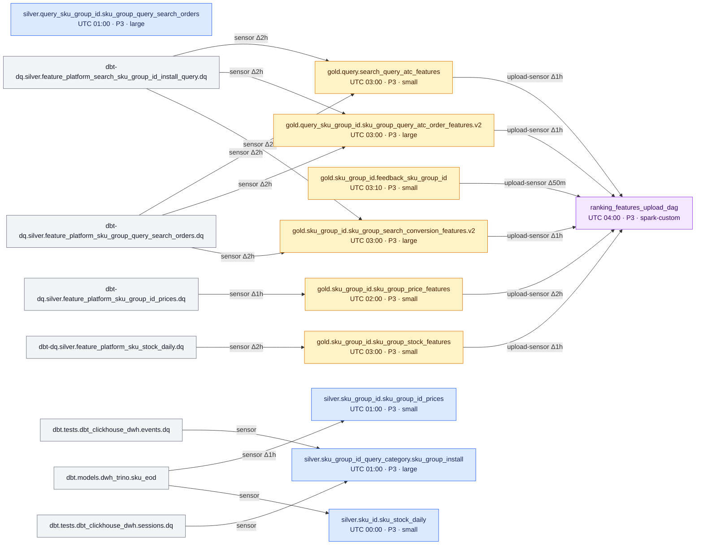
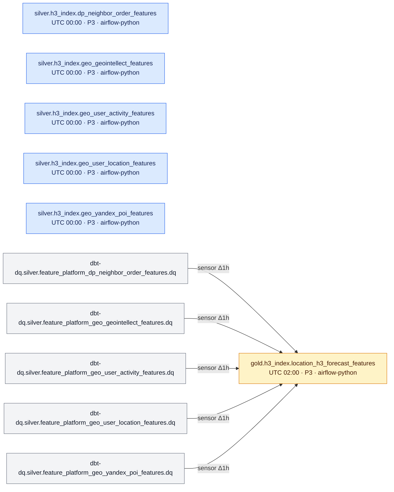
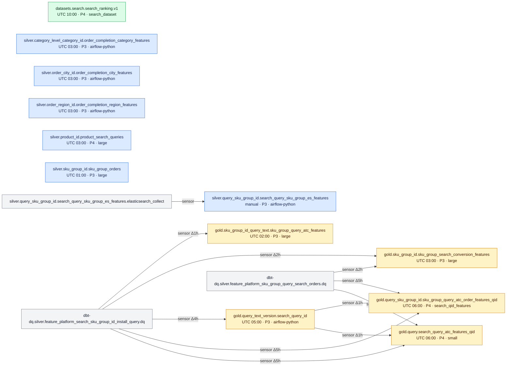

# Feature Platform: DAG dependencies and schedules

<!-- Generated by scripts/generate_feature_platform_map.py. Do not edit manually. -->

Эта карта строится из repository-managed `dag.py`, `config.yaml` и upload-конфигов.
Она показывает объявленные зависимости и cron-расписания, но не фактическое время
старта или длительность прогонов — их нужно смотреть в Airflow.

Обновление:

```bash
python3 scripts/generate_feature_platform_map.py
python3 scripts/generate_feature_platform_map.py --check
```

Всего DAG: **29**. Внутренних зависимостей: **8**. Внешних зависимостей: **26**. P3: **25**. P4: **4**.

Severity policy:

- `P3` — production upload и все repository DAG, транзитивно питающие его через sensors/DQ.
- `P4` — training datasets и отдельные backfill DAG.
- Для остальных DAG карта показывает настроенную severity без автоматической переклассификации.

## 1. Production-critical DAGs — Search

Upload DAG и все repository DAG, транзитивно питающие production feature groups.
Стрелка направлена от upstream DAG к зависимому DAG; `Δ` — разница logical date.



### Production-critical start timeline

Горизонтальная шкала показывает объявленные моменты запуска. Milestone не означает
длительность DAG.

```mermaid
gantt
    title Production-critical DAG starts (UTC)
    dateFormat HH:mm
    axisFormat %H:%M
    tickInterval 1hour
    section Production-critical
    00h00 · 1 DAG · small×1 :milestone, s0_0000, 00:00, 0m
    01h00 · 3 DAG · large×2 · small×1 :milestone, s0_0060, 01:00, 0m
    02h00 · 1 DAG · small×1 :milestone, s0_0120, 02:00, 0m
    03h00 · 4 DAG · large×2 · small×2 :milestone, s0_0180, 03:00, 0m
    03h10 · 1 DAG · small×1 :milestone, s0_0190, 03:10, 0m
    04h00 · 1 DAG · spark-custom×1 :milestone, s0_0240, 04:00, 0m
```



## 2. Production-critical DAGs — Logistics

Команда: **Logistics**. Цепочка определяется общим Airflow group tag
`location-h3-forecast` и включает итоговую gold-витрину и все связанные silver DAG.



### Logistics-critical start timeline

```mermaid
gantt
    title Logistics-critical DAG starts (UTC)
    dateFormat HH:mm
    axisFormat %H:%M
    tickInterval 1hour
    section Logistics
    00h00 · 5 DAG · airflow-python×5 :milestone, s0_0000, 00:00, 0m
    02h00 · 1 DAG · airflow-python×1 :milestone, s0_0120, 02:00, 0m
```



## 3. Offline, training and backfill DAGs

DAG, которые не входят в объявленные serving-цепочки: обучение, backfill и
standalone-подготовка данных. P3 в этом графе — кандидат на проверку severity и слота.



### Offline start timeline

```mermaid
gantt
    title Offline, training and backfill DAG starts (UTC)
    dateFormat HH:mm
    axisFormat %H:%M
    tickInterval 1hour
    section Training
    10h00 · 1 DAG · search_dataset×1 :milestone, s0_0600, 10:00, 0m
    section Backfill
    section Other
    01h00 · 1 DAG · large×1 :milestone, s2_0060, 01:00, 0m
    02h00 · 1 DAG · large×1 :milestone, s2_0120, 02:00, 0m
    03h00 · 5 DAG · large×2 · airflow-python×3 :milestone, s2_0180, 03:00, 0m
    05h00 · 1 DAG · airflow-python×1 :milestone, s2_0300, 05:00, 0m
    06h00 · 2 DAG · small×1 · search_qid_features×1 :milestone, s2_0360, 06:00, 0m
```



## Reading the map

- `small`, `medium`, `large` are shared Spark resource profiles from
  `config/spark/resources.yaml`.
- `spark-custom` is a Spark DAG with a local resources file rather than a named shared profile.
- `airflow-python` is an Airflow/Python job, including Trino/ClickHouse/Elasticsearch jobs.
- External dbt/DQ/producer DAGs are shown as grey nodes and do not belong to this repository.
- The graph records declared orchestration dependencies, not every table read visible in job code.
