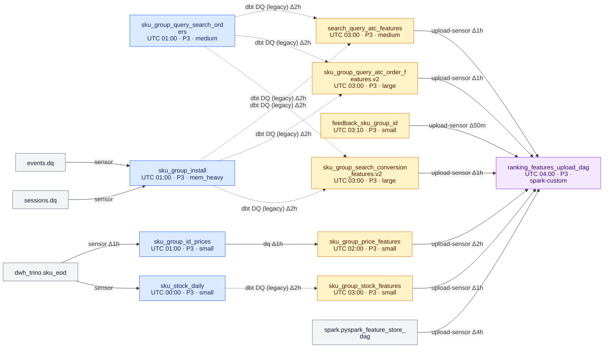
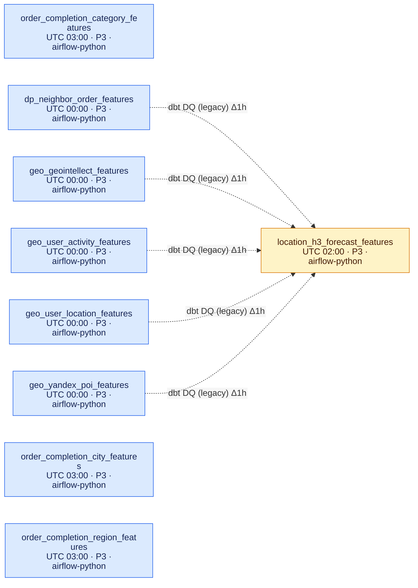
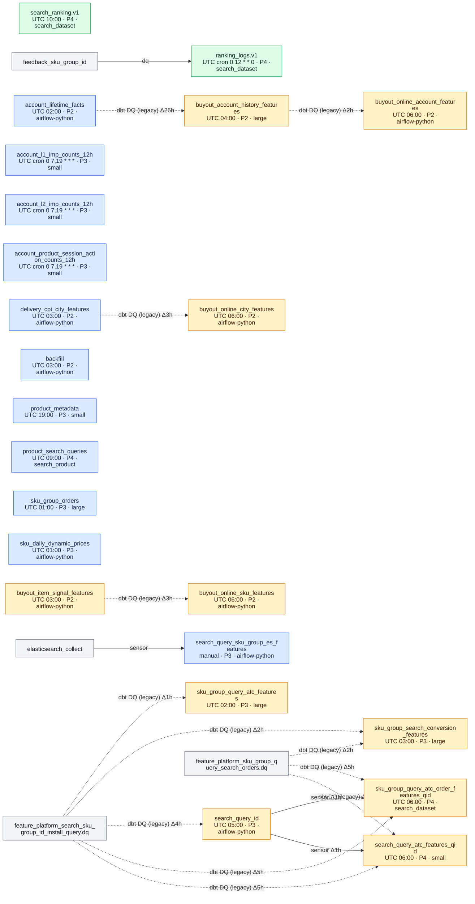
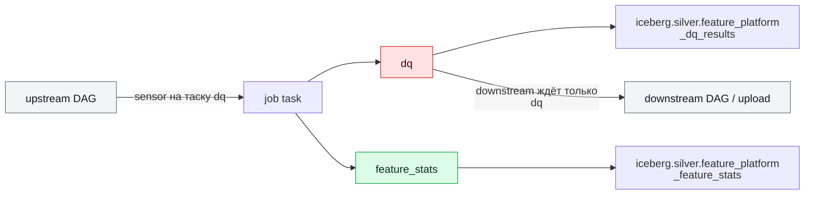

# Feature Platform: DAG dependencies and schedules

<!-- Generated by scripts/generate_feature_platform_map.py. Do not edit manually. -->

Эта карта строится из repository-managed `dag.py`, `config.yaml` и upload-конфигов.
Она показывает объявленные зависимости и cron-расписания, но не фактическое время
старта или длительность прогонов — их нужно смотреть в Airflow.

Обновление:

```bash
python3 scripts/generate_feature_platform_map.py
python3 scripts/generate_feature_platform_map.py --check
```

Всего DAG: **43**. Внутренних зависимостей: **10**. Внешних зависимостей: **30**. P1: **0**. P2: **8**. P3: **30**. P4: **5**.

Таска `dq`: **40** из **43**. Таска `feature_stats`: **40** из **43** (upload и backfill их не имеют по построению). Рёбер на устаревшем dbt-DQ-контракте: **24**.

Severity policy:

- Жёсткое требование одно: `alerts.severity` объявлена и лежит в шкале P1–P4.
- Базовое ожидание: `P3` — production upload и все DAG, транзитивно питающие его;
  `P4` — training datasets и отдельные backfill DAG.
- Более строгая severity (например `P2` на production-цепочке) — осознанное решение
  владельца энтити, а не нарушение: карта её не переклассифицирует.

## 1. Production-critical DAGs — Search

Upload DAG и все repository DAG, транзитивно питающие production feature groups.
Стрелка направлена от upstream DAG к зависимому DAG; `Δ` — разница logical date.



### Production-critical start timeline

Горизонтальная шкала показывает объявленные моменты запуска. Milestone не означает
длительность DAG.

```mermaid
gantt
    title Production-critical DAG starts (UTC)
    dateFormat HH:mm
    axisFormat %H:%M
    tickInterval 1hour
    section Production-critical
    00h00 · 1 DAG · small×1 :milestone, s0_0000, 00:00, 0m
    01h00 · 3 DAG · medium×1 · small×1 · mem_heavy×1 :milestone, s0_0060, 01:00, 0m
    02h00 · 1 DAG · small×1 :milestone, s0_0120, 02:00, 0m
    03h00 · 4 DAG · large×2 · medium×1 · small×1 :milestone, s0_0180, 03:00, 0m
    03h10 · 1 DAG · small×1 :milestone, s0_0190, 03:10, 0m
    04h00 · 1 DAG · spark-custom×1 :milestone, s0_0240, 04:00, 0m
```



## 2. Production-critical DAGs — Logistics

Команда: **Logistics**. Цепочки определяются Airflow group tags и точными DAG ids из
`config/feature_platform_map.json`.



### Logistics-critical start timeline

```mermaid
gantt
    title Logistics-critical DAG starts (UTC)
    dateFormat HH:mm
    axisFormat %H:%M
    tickInterval 1hour
    section Logistics
    00h00 · 5 DAG · airflow-python×5 :milestone, s0_0000, 00:00, 0m
    02h00 · 1 DAG · airflow-python×1 :milestone, s0_0120, 02:00, 0m
    03h00 · 3 DAG · airflow-python×3 :milestone, s0_0180, 03:00, 0m
```



## 3. Offline, training and backfill DAGs

DAG, которые не входят в объявленные serving-цепочки: обучение, backfill и
standalone-подготовка данных. P3 в этом графе — кандидат на проверку severity и слота.



### Offline start timeline

```mermaid
gantt
    title Offline, training and backfill DAG starts (UTC)
    dateFormat HH:mm
    axisFormat %H:%M
    tickInterval 1hour
    section Training
    10h00 · 1 DAG · search_dataset×1 :milestone, s0_0600, 10:00, 0m
    section Backfill
    03h00 · 1 DAG · airflow-python×1 :milestone, s1_0180, 03:00, 0m
    section Other
    01h00 · 2 DAG · large×1 · airflow-python×1 :milestone, s2_0060, 01:00, 0m
    02h00 · 2 DAG · large×1 · airflow-python×1 :milestone, s2_0120, 02:00, 0m
    03h00 · 3 DAG · large×1 · airflow-python×2 :milestone, s2_0180, 03:00, 0m
    04h00 · 1 DAG · large×1 :milestone, s2_0240, 04:00, 0m
    05h00 · 1 DAG · airflow-python×1 :milestone, s2_0300, 05:00, 0m
    06h00 · 5 DAG · small×1 · airflow-python×3 · search_dataset×1 :milestone, s2_0360, 06:00, 0m
    09h00 · 1 DAG · search_product×1 :milestone, s2_0540, 09:00, 0m
    19h00 · 1 DAG · small×1 :milestone, s2_1140, 19:00, 0m
```



## 4. DQ, feature_stats и статус миграции сенсоров

DQ и профили признаков считаются внутри DAG'а энтити: `dq` — гейт для
downstream, `feature_stats` — параллельный шаг, на который зависимости вешать
запрещено. Контракт целиком — в `AGENTS.md`, разделы `## DQ And Source Sync` и
`## Feature Stats`.



DAG энтити без таски `dq`:

- `feature-platform.layers.silver.sku_id.sku_daily_dynamic_prices`

DAG энтити без таски `feature_stats`:

- `feature-platform.layers.silver.sku_id.sku_daily_dynamic_prices`

Сенсоров на устаревшем dbt-DQ-контракте: **24**. Каждый из них уходит на фазе 3 миграции DQ — сенсор должен ждать `external_dag_id=<DAG-владелец>` и `external_task_id="dq"`:

| Downstream DAG | Ждёт |
|---|---|
| `feature-platform.layers.gold.account_id.buyout_online_account_features` | `dbt.source.trino.ml_feature_platform_gold.feature_platform_buyout_account_history_features.dq` |
| `feature-platform.layers.gold.sku_id.buyout_online_sku_features` | `dbt.source.trino.ml_feature_platform_gold.feature_platform_buyout_item_signal_features.dq` |
| `feature-platform.layers.gold.account_id.buyout_account_history_features` | `dbt.source.trino.ml_feature_platform_silver.feature_platform_account_lifetime_facts.dq` |
| `feature-platform.layers.gold.city_id_dimensional_group.buyout_online_city_features` | `dbt.source.trino.ml_feature_platform_silver.feature_platform_delivery_cpi_city_features.dq` |
| `feature-platform.layers.gold.h3_index.location_h3_forecast_features` | `dbt.source.trino.ml_feature_platform_silver.feature_platform_dp_neighbor_order_features.dq` |
| `feature-platform.layers.gold.h3_index.location_h3_forecast_features` | `dbt.source.trino.ml_feature_platform_silver.feature_platform_geo_geointellect_features.dq` |
| `feature-platform.layers.gold.h3_index.location_h3_forecast_features` | `dbt.source.trino.ml_feature_platform_silver.feature_platform_geo_user_activity_features.dq` |
| `feature-platform.layers.gold.h3_index.location_h3_forecast_features` | `dbt.source.trino.ml_feature_platform_silver.feature_platform_geo_user_location_features.dq` |
| `feature-platform.layers.gold.h3_index.location_h3_forecast_features` | `dbt.source.trino.ml_feature_platform_silver.feature_platform_geo_yandex_poi_features.dq` |
| `feature-platform.layers.gold.query.search_query_atc_features` | `dbt.source.trino.ml_feature_platform_silver.feature_platform_search_sku_group_id_install_query.dq` |
| `feature-platform.layers.gold.query.search_query_atc_features_qid` | `dbt.source.trino.ml_feature_platform_silver.feature_platform_search_sku_group_id_install_query.dq` |
| `feature-platform.layers.gold.query_sku_group_id.sku_group_query_atc_order_features.v2` | `dbt.source.trino.ml_feature_platform_silver.feature_platform_search_sku_group_id_install_query.dq` |
| `feature-platform.layers.gold.query_sku_group_id.sku_group_query_atc_order_features_qid` | `dbt.source.trino.ml_feature_platform_silver.feature_platform_search_sku_group_id_install_query.dq` |
| `feature-platform.layers.gold.query_text_version.search_query_id` | `dbt.source.trino.ml_feature_platform_silver.feature_platform_search_sku_group_id_install_query.dq` |
| `feature-platform.layers.gold.sku_group_id.sku_group_search_conversion_features` | `dbt.source.trino.ml_feature_platform_silver.feature_platform_search_sku_group_id_install_query.dq` |
| `feature-platform.layers.gold.sku_group_id.sku_group_search_conversion_features.v2` | `dbt.source.trino.ml_feature_platform_silver.feature_platform_search_sku_group_id_install_query.dq` |
| `feature-platform.layers.gold.sku_group_id_query_text.sku_group_query_atc_features` | `dbt.source.trino.ml_feature_platform_silver.feature_platform_search_sku_group_id_install_query.dq` |
| `feature-platform.layers.gold.query.search_query_atc_features` | `dbt.source.trino.ml_feature_platform_silver.feature_platform_sku_group_query_search_orders.dq` |
| `feature-platform.layers.gold.query.search_query_atc_features_qid` | `dbt.source.trino.ml_feature_platform_silver.feature_platform_sku_group_query_search_orders.dq` |
| `feature-platform.layers.gold.query_sku_group_id.sku_group_query_atc_order_features.v2` | `dbt.source.trino.ml_feature_platform_silver.feature_platform_sku_group_query_search_orders.dq` |
| `feature-platform.layers.gold.query_sku_group_id.sku_group_query_atc_order_features_qid` | `dbt.source.trino.ml_feature_platform_silver.feature_platform_sku_group_query_search_orders.dq` |
| `feature-platform.layers.gold.sku_group_id.sku_group_search_conversion_features` | `dbt.source.trino.ml_feature_platform_silver.feature_platform_sku_group_query_search_orders.dq` |
| `feature-platform.layers.gold.sku_group_id.sku_group_search_conversion_features.v2` | `dbt.source.trino.ml_feature_platform_silver.feature_platform_sku_group_query_search_orders.dq` |
| `feature-platform.layers.gold.sku_group_id.sku_group_stock_features` | `dbt.source.trino.ml_feature_platform_silver.feature_platform_sku_stock_daily.dq` |

## Reading the map

- `small`, `medium`, `large` are shared Spark resource profiles from
  `config/spark/resources.yaml`.
- `spark-custom` is a Spark DAG with a local resources file rather than a named shared profile.
- `airflow-python` is an Airflow/Python job, including Trino/ClickHouse/Elasticsearch jobs.
- Сплошная стрелка `dq` — актуальный контракт: сенсор ждёт таску `dq` DAG'а-владельца.
- Пунктирная стрелка `dbt DQ (legacy)` — сенсор всё ещё ждёт внешний dbt-DQ-DAG.
- External dbt/DQ/producer DAGs are shown as grey nodes and do not belong to this repository.
- The graph records declared orchestration dependencies, not every table read visible in job code.
